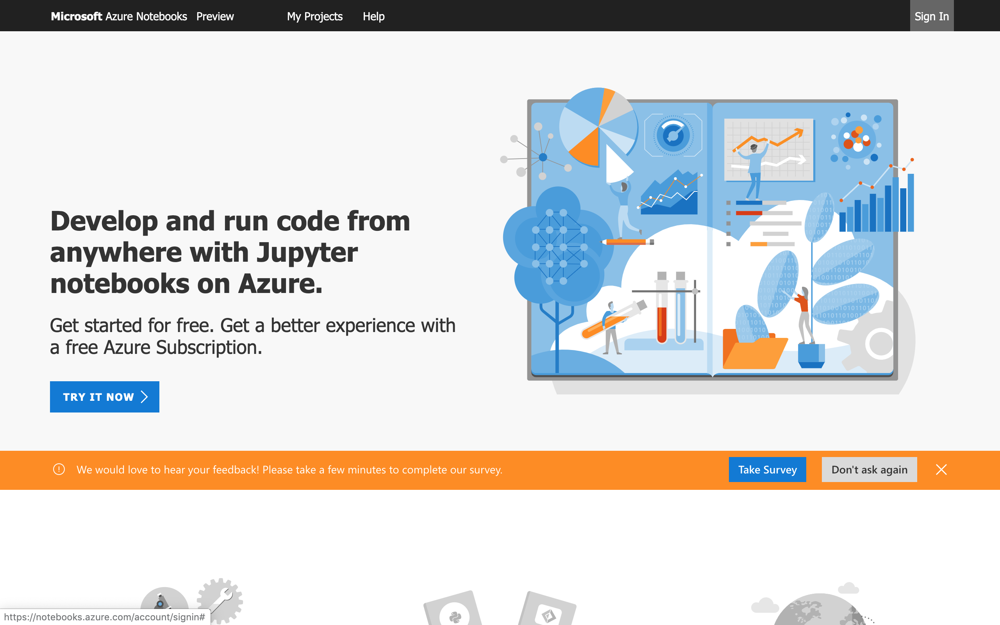
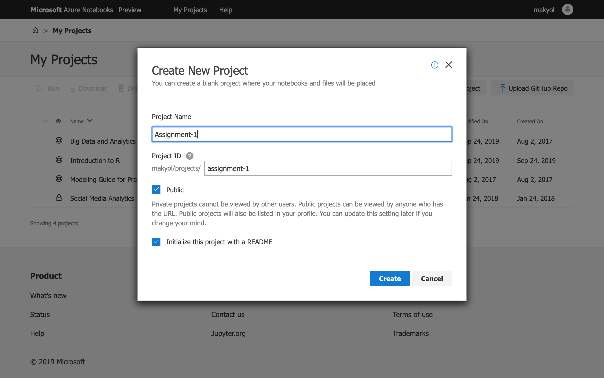
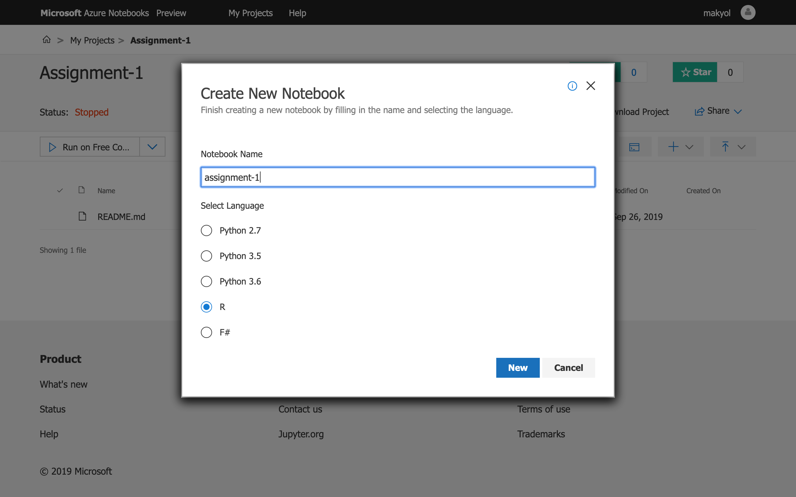
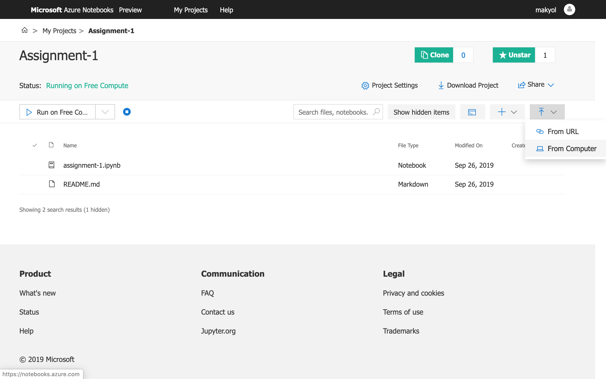
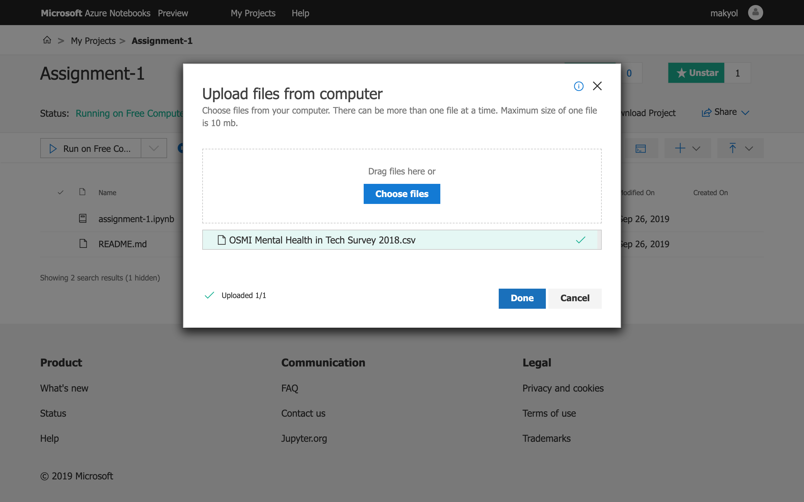
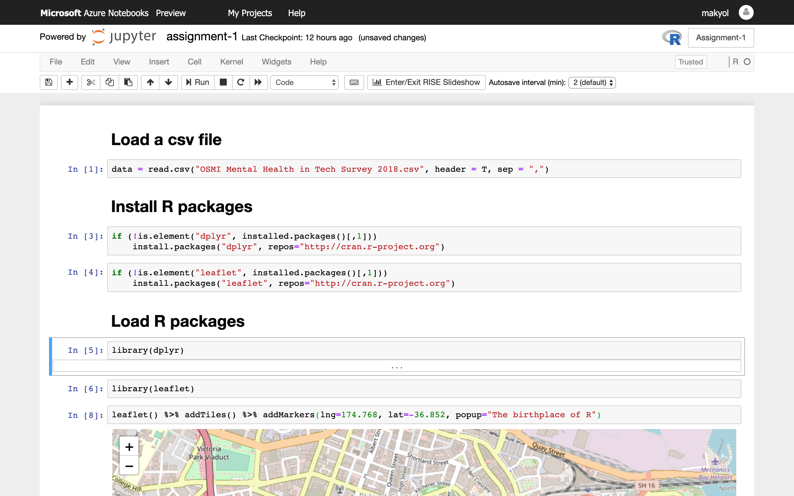
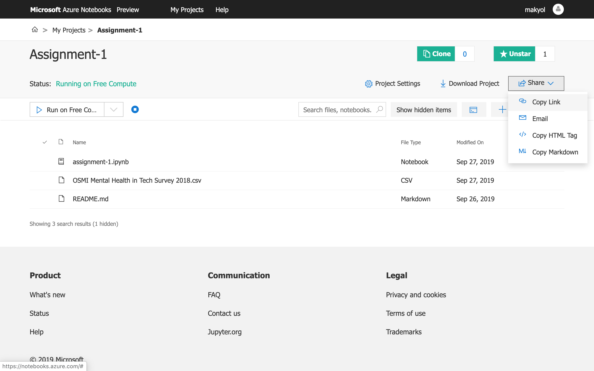

```{r setup, include=FALSE}
knitr::opts_chunk$set(echo = TRUE)
```

In this course, we are going to use Azure Notebooks, which is a hosted Jupyter Notebooks service freely offered by Microsoft, so that you can focus on learning R rather than dealing with setting up your development environment.
 
The Jupyter Notebook is an open-source web application that allows you to create and share documents that contain live code, equations, visualizations, and narrative text. Although we are going to use R in this course, The Jupyter Notebook supports many programming languages such as Python, Julia, Scala, and many more. 

Additionally, it is a good idea to get yourself familiar with The Jupyter Notebook as it is one of those tools that is widely used in the data science community.

You will be asked to complete all your projects on Azure Notebooks and deliver your assignment as a public Azure Notebooks project with the assistant. It is your own responsibility not to share your projects with other students but only with the course assistant. 

In this tutorial, we are going to introduce the Azure Notebooks environment. Please follow the steps presented in the next pages by yourself and share your public project link in the Odtu Class as your first assignment.

Tutorial 1

In this course, we are going to use Azure Notebooks, which is a hosted Jupyter Notebooks service freely offered by Microsoft, so that you can focus on learning R rather than dealing with setting up your development environment.
 
The Jupyter Notebook is an open-source web application that allows you to create and share documents that contain live code, equations, visualizations, and narrative text. Although we are going to use R in this course, The Jupyter Notebook supports many programming languages such as Python, Julia, Scala, and many more. 

Additionally, it is a good idea to get yourself familiar with The Jupyter Notebook as it is one of those tools that is widely used in the data science community.

You will be asked to complete all your projects on Azure Notebooks and deliver your assignment as a public Azure Notebooks project with the assistant. It is your own responsibility not to share your projects with other students but only with the course assistant. 

In this tutorial, we are going to introduce the Azure Notebooks environment. Please follow the steps presented in the next pages by yourself and share your public project link in the Odtu Class as your first assignment.


## Step 1
You can create an account by visiting the [https://notebooks.azure.com/](https://notebooks.azure.com/).

 

## Step 2
Go to My Projects and click New Project to create your project.

 
## Step 3
Enter a project name, make sure to set it as Public, especially for your assignments that you are going to share with the assistant.



## Step 4
After you created the project, you can create your first Notebook, click the plus button on the right and select Notebook.


 
## Step 5
Enter a name for the Notebook and select R language.


 

## Step 6
You can also upload your datasets to the project by clicking the button at the right with arrow button.

 

## Step 7
You can drag & drop or choose the files you want to upload to the project.

 

## Step 8
You can open the Jupyter Notebook file and write your code and comments for the project.

 

## Step 9
Finally, you can get the public link to your project by clicking the Share and Copy Link buttons.


